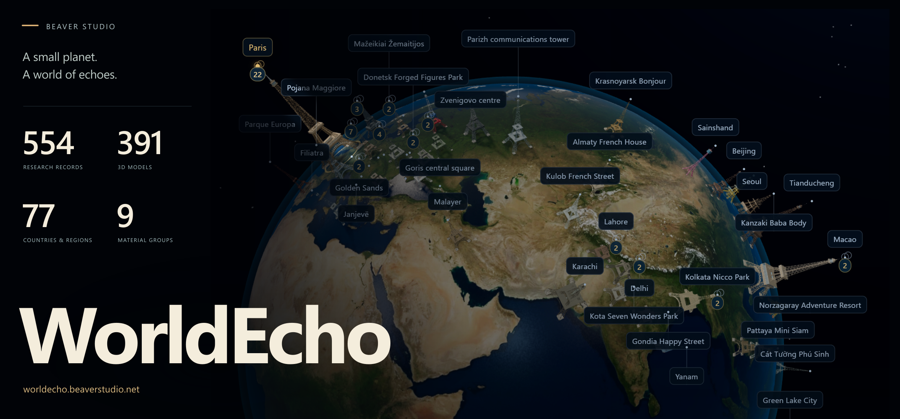
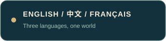
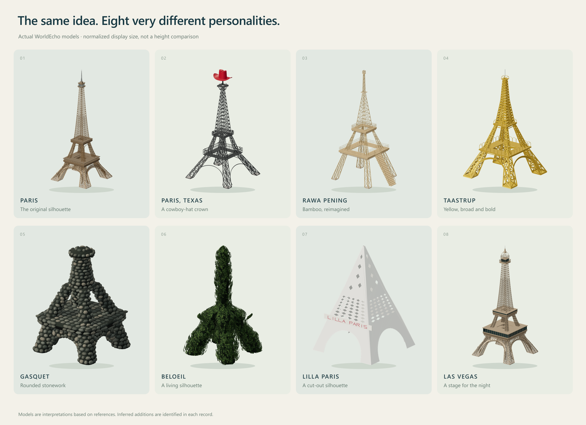
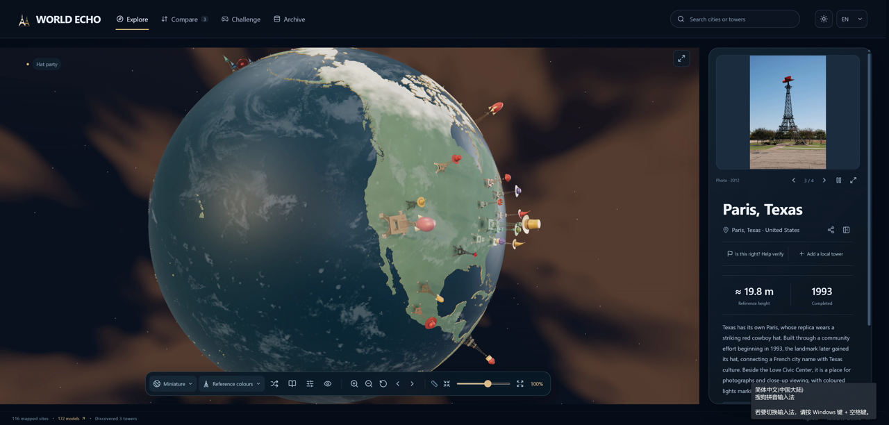

<p align="center"><a href="README.md">English</a> · <a href="README.zh-CN.md">简体中文</a> · <a href="README.fr.md">Français</a></p>

<p align="center"><a href="https://worldecho.beaverstudio.net/?lang=fr"></a></p>

<p align="center">
  <a href="https://worldecho.beaverstudio.net/?lang=fr"></a>
  <a href="https://worldecho.beaverstudio.net/catalog.html?lang=fr"></a>
  <a href="README.md"></a>
</p>

**Un monument parisien. Des centaines de réinterprétations locales. Un monde que l’on fait tourner du bout des doigts.**

WorldEcho est un atlas interactif de répliques de la tour Eiffel, d’adaptations locales et de structures apparentées. Explorez une planète miniature, approchez chaque modèle, consultez ses sources et découvrez ce qui rattache une silhouette familière à un lieu particulier.

## Une silhouette familière, des caractères singuliers



Un chapeau de cow-boy rouge au Texas. De larges poutres jaunes à Taastrup. Une tour en pierres arrondies. Une autre taillée dans un arbre vivant. La collection rend ces différences visibles : chaque lieu possède son interprétation du modèle parisien.

Les modèles s’appuient sur des images de référence. Lorsqu’une partie de la structure n’est pas visible, une restitution fondée sur les proportions porte la mention **« contient des éléments reconstitués par déduction »**. La précision visuelle d’un modèle ne prouve ni une hauteur mesurée, ni une position exacte, ni l’état actuel du monument.

## Un globe qui invite aussi à jouer

<p align="center"><a href="docs/assets/hat-flight.mp4"></a></p>

<p align="center"><a href="docs/assets/hat-flight.mp4"><strong>Voir le vol du chapeau en entier ↗</strong></a> · MP4 original, environ 44 Mo · <a href="https://worldecho.beaverstudio.net/?lang=fr">Essayer sur le globe</a></p>

L’enregistrement conserve sa durée, son cadrage et sa vitesse d’origine. Il montre l’application réelle, y compris les images de référence affichées dans l’interface ; ces photographies conservent leurs droits propres.

Trois interactions s’inspirent des lieux représentés :

| Lieu | Élément à toucher | Effet |
|---|---|---|
| Paris, Texas | Le chapeau de cow-boy rouge | Une traînée lumineuse accompagne le vol d’un chapeau autour de la planète. |
| Las Vegas | La petite lumière de la tour | Une vague lumineuse transforme le globe en scène nocturne collective. |
| Rawa Pening | Les pieds de la tour en bambou | Des ondulations parcourent la planète et éclairent les tours sur leur passage. |

Les effets suivent les tours visibles avec les filtres actifs. Faites glisser la vue pour reprendre la caméra, réinitialisez pour retrouver la vue d’ensemble, ou partagez un lien qui conserve la sélection et les effets. Les préférences de réduction des animations sont respectées. Ces expériences sont des interprétations ludiques inspirées des lieux.

## Explorer largement, garder les sources à portée de main

- **Globe :** les fiches modélisées apparaissent en 3D, les autres sous forme de marqueurs ; les positions vérifiées et approximatives sont distinguées.
- **Collection :** filtrez par catégorie, contexte, apparence historique et dimensions disponibles ; les structures apparentées restent accessibles.
- **Fiches :** informations sur le lieu, liens vers les sources, contexte du modèle et accès aux cartes restent associés à chaque entrée.
- **Comparaison :** observez plusieurs structures ensemble ; les comparaisons numériques de hauteur utilisent les dimensions sourcées admissibles et excluent la géométrie déduite.
- **Archives :** recherchez les fiches en chinois, en anglais ou en français, avec leurs champs non résolus et leurs alias traçables.
- **Corrections :** aidez à identifier un lieu, à préciser une position ou à ajouter une tour de votre ville.

La collection de modèles, les points géographiques et les fiches de recherche sont des ensembles différents. Leurs nombres figurent dans les catalogues générés et peuvent évoluer avec le rapprochement des alias et l’amélioration des sources. Une position approximative est un point de départ qui peut être corrigé ; elle ne remplace jamais silencieusement des coordonnées validées.

## Exécuter le projet en local

```bash
git clone https://github.com/UncleK/WorldEcho.git
cd WorldEcho
pnpm install
pnpm dev
```

Utilisez Node.js 24 ou une version ultérieure, ainsi que la version de pnpm déclarée dans `package.json`. L’application utilise React, TypeScript, Three.js et React Three Fiber, avec Vite pour la compilation.

```bash
pnpm typecheck
pnpm test
pnpm build
pnpm preview
```

Le dépôt public contient le code et des instantanés des données publiques. Les photographies de référence de tiers et les archives de travail internes ne sont pas distribuées comme des ressources sous licence libre. Consultez les [notes d’export](docs/EXPORT.md) pour connaître le contenu du dépôt et la préparation de sa version publique.

## Une fabrication que l’on peut examiner

Le projet distingue les images de référence, les caractéristiques observées, les parties déduites, les paramètres des modèles et les décisions de contrôle visuel. La comparaison avec une photo et l’examen d’un rendu restent distincts d’un contrôle du code ou de la géométrie. Les éclairages nocturnes reposent soit sur une palette photographique documentée, soit sur une création originale inspirée du lieu.

La couverture du README est composée par code autour d’une capture réelle du globe WorldEcho ; la planche de modèles utilise les rendus créés pour le projet. Ces deux compositions ne contiennent aucune photographie de site provenant de tiers. Les crédits des textures géographiques et les licences des ressources sont conservés avec les fichiers distribués. Voir les [crédits et licences des ressources](THIRD_PARTY_ASSETS.md) et les [droits du projet](COPYRIGHT.md).

Pour régénérer la couverture, la planche de modèles et les boutons de navigation à partir de la capture et des rendus inclus :

```bash
pnpm showcase:generate
```

<p align="center"><a href="https://worldecho.beaverstudio.net/?lang=fr">Ouvrir WorldEcho ↗</a> · <a href="README.md">English</a> · <a href="README.zh-CN.md">简体中文</a></p>
