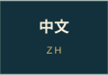

https://github.com/user-attachments/assets/e99b04a6-173a-4352-9c4f-7e2346a0e871

<p align="center"><a href="https://worldecho.beaverstudio.net/"></a><a href="https://worldecho.beaverstudio.net/catalog.html"></a><a href="README.md"></a><a href="README.zh-CN.md"></a><a href="README.fr.md"></a></p>

<p align="center"><a href="https://worldecho.beaverstudio.net/"></a></p>

**从巴黎的一座地标出发，看它如何在世界各地长出自己的模样。**

WorldEcho · 世界回响是一座可以转动、靠近、比较和分享的微缩星球。这里收录埃菲尔铁塔的复刻、地方改造与相关建筑；每个模型都连着它所在的地方、参考资料，以及仍待确认的细节。

## 熟悉的轮廓，各自的性格


德州塔戴着红色牛仔帽，Taastrup塔用醒目的黄色宽梁，还有圆石堆砌的塔、修剪成塔形的树。同一个轮廓，到了不同地方，会变成不同的故事。

模型以参考图像为依据。照片没有拍全的部分可以按比例补全，并明确标注 **「含推测补全」**。模型细致，不表示高度经过测量、位置足够精确，或照片中的状态仍然存在。

## 地球上，还藏着三个小玩法

[下载完整原始录屏](docs/assets/hat-flight.mp4) · MP4，约 44 MB。

录屏保留完整时长、画幅与播放速度，展示实际产品界面，其中可能出现内置参考照片；这些照片仍保留各自的权利。

| 找到 | 点击 | 会发生什么 |
|---|---|---|
| 德州巴黎塔 | 红色牛仔帽 | 光带带着帽子掠过星球，让各地塔顶换上帽子。 |
| 拉斯维加斯塔 | 塔腰小灯 | 灯波向外传播，各塔接上自己的地方夜景。 |
| 湖上竹塔 | 塔脚 | 涟漪沿球面传开，经过的塔出现水光与轻微浮动。 |

玩法使用当前筛选后展示的塔。拖动可接管镜头，重置可恢复全景和原先的天气；分享链接保留选择与效果，并尊重系统「减少动态」设置。这些是受地方特色启发的视觉演绎。

## 尽量让资料可探索，也让不确定的地方看得见

- **地球探索：** 有模型的条目显示模型，其余条目显示标记；核实位置与大致位置分别标注。
- **模型筛选：** 按分类、场所、历史外观和已有尺寸筛选，保留相关建筑与以前完成的模型。
- **地方档案：** 名称、位置、来源、模型说明和地图入口跟随同一个条目。
- **结构比较：** 一起查看不同塔形；数值高度比较使用符合条件的来源尺寸，推测几何不参与严格高度比较。
- **三语资料集：** 用中文、英文或法语搜索，保留未知字段、别名与来源追溯。
- **共同补充：** 核对一条资料、修正一个位置，或带来一座家乡的塔。

模型数、地图地点数、研究条目数是不同集合。数量保存在生成的资料快照中，会随去重和补证更新。大致位置是寻找实物的起点，后续可以纠正；不会悄悄覆盖已采用的坐标。

## 本地运行

```bash
git clone https://github.com/UncleK/WorldEcho.git
cd WorldEcho
pnpm install
pnpm dev
```

使用 Node.js 24 或更新版本，以及 `package.json` 指定的 pnpm。前端采用 React、TypeScript、Three.js 和 React Three Fiber，使用 Vite 构建。

```bash
pnpm typecheck
pnpm test
pnpm build
pnpm preview
```

公开副本包含源码与公开资料快照。第三方实景参考照片、内部取证工作目录不会作为开放素材打包进来。具体内容与公开构建方式见 [导出说明](docs/EXPORT.md)。

## 让制作过程可以被检查

参考照片、照片中观察到的特征、推测补全、模型配方与视觉审核分别记录。代码或几何检查不能代替看过原图、再核对真实渲染。夜景也区分照片配色参考与逐塔原创方案。

README封面由代码编排真实产品地球截图，模型墙使用项目自制模型画像。这两张作品不含第三方实景照片。地理纹理署名与上游许可随素材保留，详见 [素材署名与许可](THIRD_PARTY_ASSETS.md) 和 [项目版权](COPYRIGHT.md)。

使用随项目提供的地球截图与模型画像，重新生成封面、模型墙和导航图：

```bash
pnpm showcase:generate
```

<p align="center"><a href="https://worldecho.beaverstudio.net/">打开 WorldEcho ↗</a> · <a href="README.md">English</a> · <a href="README.fr.md">Français</a></p>
